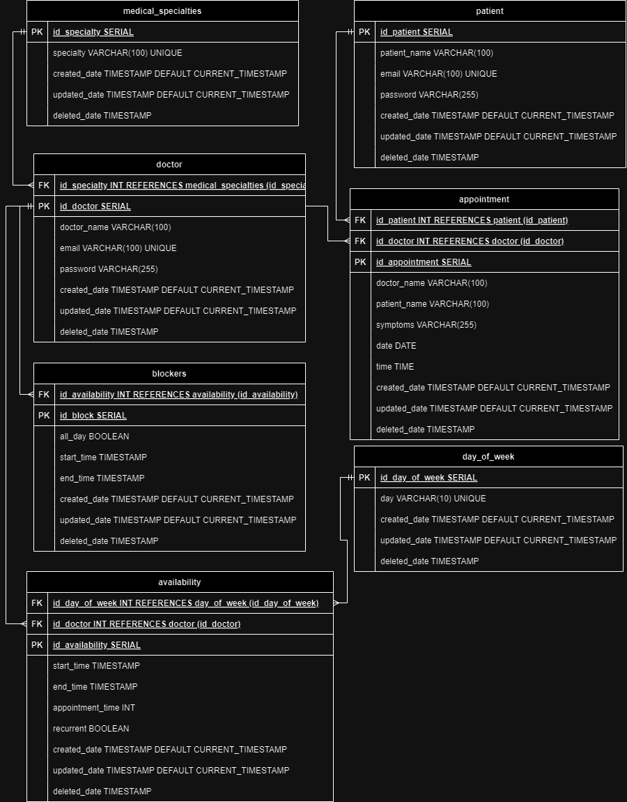

# Hospital Appointment Scheduler

### Contents

- [Description](#description)
- [Schema](#schema)
- [API](#api)
  - [Base URL](#base-url)
  - [Doctor](#doctor)
    - [Get all doctors](#get-all-doctors)
    - [Get one doctor by id](#get-one-doctor-by-id)
    - [Create a new doctor](#create-a-new-doctor)
    - [Edit a doctor](#edit-a-doctor)
    - [Delete a doctor](#delete-a-doctor)
  - [Patient](#patient)
    - [Get all patients](#get-all-patients)
    - [Get one patient by id](#get-one-patient-by-id)
    - [Create a new patient](#create-a-new-patient)
    - [Edit a patient](#edit-a-patient)
    - [Delete a patient](#delete-a-patient)
  - [Medical Specialties](#medical-specialties)
    - [Get all medical specialties](#get-all-medical-specialties)
  - [Appointment](#appointment)
    - [Get the first available date available](#get-the-first-available-date-available)
    - [Create an appointment with a specific doctor](#create-an-appointment-with-a-specific-doctor)
    - [Create an appointment with a specific specialty](#create-an-appointment-with-a-specific-specialty)
- [Install project](#-Install-project)
- [Environment variables](#-environment-variables)
- [Built with](#-built-with)

---

## Description

This project is a hospital appointment scheduling system developed to carry out the process of scheduling medical appointments. The patient can enter their symptoms or specify a medical specialization, and the system will find the closest available appointment date with a medical specialist. The system takes into account several factors such as doctor availability, the number of patients and the duration of each consultation. The API provides endpoints for managing doctors, patients, medical specialties, and appointments, designed for the hospital healthcare environment.

<hr>

## Schema



## API

### Base URL

```javascript
const BASE_URL = "http://localhost:3001/api/v1");
```

<hr>

### Doctor

#### Get all doctors

##### `/doctor`

- **GET** :

```javascript
`${BASE_URL}/doctor?search={search string}&limit={limit number}&page={page number}`;
```

Get all doctors

| Parameter | Type   | Required | Description                                   | Default |
| --------- | ------ | -------- | --------------------------------------------- | ------- |
| limit     | string | No       | Maximum number of records returned.           | 5       |
| page      | number | No       | To return records skipping the limit n times. | 0       |
| search    | string | No       | Part of the name to search for.               | none    |

<details>
<summary>
Reponse 
</summary>
<br>

Status `200 OK`
<br>

```json
{
  "results": [
    {
      "id_doctor": 1,
      "doctor_name": "Doctor Lorem",
      "specialty": "Surgery",
      "email": "doctor_lorem@email.com"
    },
    {
      "id_doctor": 2,
      "doctor_name": "Doctor Ipsum",
      "specialty": "Cardiology",
      "email": "doctor_ipsum@email.com"
    },
    {
      "id_doctor": 3,
      "doctor_name": "Doctor Ipsum Lorem",
      "specialty": "Urology",
      "email": "doctor_ipsum_lorem@email.com"
    },
    {
      "id_doctor": 4,
      "doctor_name": "Doctor Cicero",
      "specialty": "Ophthalmology",
      "email": "doctor_cicero@email.com"
    },
    {
      "id_doctor": 5,
      "doctor_name": "Doctor Consectetur",
      "specialty": "Generalist",
      "email": "doctor_consectetur@email.com"
    }
  ],
  "total": 100
}
```

</details>

#### Get one doctor by id

##### `/doctor/:doctorId`

- **GET** :

```javascript
`${BASE_URL}/doctor/{doctorId}`;
```

Get one doctor by id

| Parameter | Type   | Required | Description | Default |
| --------- | ------ | -------- | ----------- | ------- |
| id        | string | yes      | Doctor id.  | none    |

<details>
<summary>
Reponse 
</summary>
<br>

Status `200 OK`

```json
{
  "id_doctor": 1,
  "doctor_name": "Doctor Lorem",
  "specialty": "Surgery",
  "email": "doctor_lorem@email.com"
}
```

OR

Status `404 Not found`

```json
{ "message": "Doctor not found!" }
```

</details>

#### Create a new doctor

##### `/doctor`

- **POST** :

```javascript
`${BASE_URL}/doctor`;
```

Body required:

```json
{
  "doctor_name": "Doctor Lorem",
  "id_specialty": 1,
  "email": "doctor_lorem@email.com",
  "password": "password123"
}
```

| Body parameter | Type   | Required | Description     | Unique |
| -------------- | ------ | -------- | --------------- | ------ |
| doctor_name    | string | yes      | Doctor name     | no     |
| id_specialty   | number | no       | Specialty\*     | no     |
| email          | string | yes      | Doctor email    | yes    |
| password       | string | yes      | Strong password | no     |

\ \* from table [medical_specialties](#medical-specialties)

<details>
<summary>
Reponse 
</summary>

<br>

Status `201 OK`

```json
{
  "id_doctor": 1,
  "doctor_name": "Doctor Lorem",
  "specialty": "Surgery",
  "email": "doctor_lorem@email.com"
}
```

OR

Status `400 Bad request`

```json
{
  "message": "Invalid parameters!",
  "bad_parameters": ["email", "id_specialty"]
}
```

</details>

#### Edit a doctor

##### `/doctor/{doctorId}`

- **PATCH** :

```javascript
`${BASE_URL}/doctor/{doctorId}`;
```

- Headers (application/json)

      Authorization: Bearer [access_token]

Body required:

```json
{
  "doctor_name": "Doctor Lorem",
  "id_specialty": 1,
  "email": "doctor_lorem@email.com",
  "password": "password123"
}
```

| Body parameter | Type   | Required | Description     | Unique |
| -------------- | ------ | -------- | --------------- | ------ |
| doctor_name    | string | no       | Doctor name     | no     |
| id_specialty   | number | no       | Specialty\*     | no     |
| email          | string | no       | Doctor email    | yes    |
| password       | string | no       | Strong password | no     |

\ \* from table [medical_specialties](#medical-specialties)

<details>
<summary>
Reponse 
</summary>

<br>

Status `200 OK`

```json
{
  "id_doctor": 1,
  "doctor_name": "Doctor Lorem",
  "specialty": "Surgery",
  "email": "doctor_lorem@email.com"
}
```

OR

Status `400 Bad request`

```json
{
  "message": "Invalid parameters!",
  "bad_parameters": ["email", "id_specialty"]
}
```

OR

Status `401 Unathorized`

```json
{
  "message": "Your token is invalid!"
}
```

OR

Status `404 Not found`

```json
{ "message": "Doctor not found!" }
```

</details>

#### Delete a doctor

##### `/doctor/{doctorId}`

- **DELETE** :

```javascript
`${BASE_URL}/doctor/{doctorId}`;
```

- Headers (application/json)

      Authorization: Bearer [access_token]

Body required:

```
none
```

<details>
<summary>
Reponse 
</summary>

<br>

Status `204 No Content`

```
 No Content
```

OR

Status `401 Unathorized`

```json
{
  "message": "Your token is invalid!"
}
```

OR

Status `404 Not found`

```json
{ "message": "Doctor not found!" }
```

</details>

<hr>

### Patient

#### Get all patient

##### `/patient`

- **GET** :

```javascript
`${BASE_URL}/patient?search={search string}&limit={limit number}&page={page number}`;
```

**Only doctors can access the patient list!**

- Headers (application/json)

      Authorization: Bearer [access_token]

Get all patient

| Parameter | Type   | Required | Description                                   | Default |
| --------- | ------ | -------- | --------------------------------------------- | ------- |
| limit     | string | No       | Maximum number of records returned.           | 5       |
| page      | number | No       | To return records skipping the limit n times. | 0       |
| search    | string | No       | Part of the name to search for.               | none    |

<details>
<summary>
Reponse 
</summary>
<br>

Status `200 OK`
<br>

```json
{
  "results": [
    {
      "id_patient": 1,
      "patient_name": "Patient Lorem",
      "email": "patient_lorem@email.com"
    },
    {
      "id_patient": 2,
      "patient_name": "Patient Ipsum",
      "email": "patient_ipsum@email.com"
    },
    {
      "id_patient": 3,
      "patient_name": "Patient Ipsum Lorem",
      "email": "patient_ipsum_lorem@email.com"
    },
    {
      "id_patient": 4,
      "patient_name": "Patient Cicero",
      "email": "patient_cicero@email.com"
    },
    {
      "id_patient": 5,
      "patient_name": "Patient Consectetur",
      "email": "patient_consectetur@email.com"
    }
  ],
  "total": 100
}
```

OR

Status `401 Unathorized`

```json
{
  "message": "Your token is invalid or you are not allowed!"
}
```

OR

Status `403 Forbidden`

```json
{
  "message": "You are not allowed!"
}
```

</details>

#### Get one patient by id

##### `/patient/:patientId`

- **GET** :

```javascript
`${BASE_URL}/patient/{patientId}`;
```

**Only the doctor or the patient can access this information**

- Headers (application/json)

        Authorization: Bearer [access_token]

  Get one patient by id

| Parameter | Type   | Required | Description | Default |
| --------- | ------ | -------- | ----------- | ------- |
| id        | string | yes      | Patient id. | none    |

<details>
<summary>
Reponse 
</summary>
<br>

Status `200 OK`

```json
{
  "id_patient": 1,
  "patient_name": "patient Lorem",
  "email": "patient_lorem@email.com"
}
```

OR

Status `404 Not found`

```json
{ "message": "Patient not found!" }
```

OR

Status `401 Unathorized`

```json
{
  "message": "Your token is invalid!"
}
```

Status `403 Forbidden`

```json
{
  "message": "You are not allowed!"
}
```

</details>

#### Create a new patient

##### `/patient`

- **POST** :

```javascript
`${BASE_URL}/patient`;
```

Body required:

```json
{
  "patient_name": "Patient Lorem",
  "email": "patient_lorem@email.com",
  "password": "password123"
}
```

| Body parameter | Type   | Required | Description     | Unique |
| -------------- | ------ | -------- | --------------- | ------ |
| patient_name   | string | yes      | Patient name    | no     |
| email          | string | yes      | Patient email   | yes    |
| password       | string | yes      | Strong password | no     |

<details>
<summary>
Reponse 
</summary>

<br>

Status `201 OK`

```json
{
  "id_patient": 1,
  "patient_name": "patient Lorem",
  "email": "patient_lorem@email.com"
}
```

OR

Status `400 Bad request`

```json
{
  "message": "Invalid parameters!",
  "bad_parameters": ["email", "password"]
}
```

</details>

#### Edit a patient

##### `/patient/{patientId}`

- **PATCH** :

```javascript
`${BASE_URL}/patient/{patientId}`;
```

- Headers (application/json)

      Authorization: Bearer [access_token]

Body required:

```json
{
  "patient_name": "Patient Lorem",
  "email": "patient_lorem@email.com",
  "password": "password123"
}
```

| Body parameter | Type   | Required | Description     | Unique |
| -------------- | ------ | -------- | --------------- | ------ |
| patient_name   | string | no       | Patient name    | no     |
| email          | string | no       | Patient email   | yes    |
| password       | string | no       | Strong password | no     |

<details>
<summary>
Reponse 
</summary>

<br>

Status `200 OK`

```json
{
  "id_patient": 1,
  "patient_name": "Patient Lorem",
  "email": "patient_lorem@email.com"
}
```

OR

Status `400 Bad request`

```json
{
  "message": "Invalid parameters!",
  "bad_parameters": ["email"]
}
```

OR

Status `401 Unathorized`

```json
{
  "message": "Your token is invalid!"
}
```

OR

Status `404 Not found`

```json
{ "message": "Patient not found!" }
```

</details>

#### Delete a patient

##### `/patient/{patientId}`

- **DELETE** :

```javascript
`${BASE_URL}/patient/{patientId}`;
```

- Headers (application/json)

      Authorization: Bearer [access_token]

Body required:

```
none
```

<details>
<summary>
Reponse 
</summary>

<br>

Status `204 No Content`

```
 No Content
```

OR

Status `401 Unathorized`

```json
{
  "message": "Your token is invalid!"
}
```

OR

Status `404 Not found`

```json
{ "message": "patient not found!" }
```

</details>

<hr>

### Medical Specialties

#### Get all medical specialties

##### `/medical_specialties`

- **GET** :

```javascript
`${BASE_URL}/medical_specialties?search={search string}&limit={limit number}&page={page number}`;
```

Get medical specialties

| Parameter | Type   | Required | Description                                   | Default |
| --------- | ------ | -------- | --------------------------------------------- | ------- |
| limit     | string | No       | Maximum number of records returned.           | 5       |
| page      | number | No       | To return records skipping the limit n times. | 0       |
| search    | string | No       | Part of the name to search for.               | none    |

<details>
<summary>
Reponse 
</summary>
<br>

Status `200 OK`
<br>

```json
{
  "results": [
    {
      "id_specialty": 1,
      "specialty": "Surgery"
    },
    {
      "id_specialty": 2,
      "specialty": "Cardiology"
    },
    {
      "id_specialty": 3,
      "specialty": "Urology"
    },
    {
      "id_specialty": 4,
      "specialty": "Ophthalmology"
    },
    {
      "id_specialty": 5,
      "specialty": "Generalist"
    }
  ],
  "total": 10
}
```

</details>

### Appointment

#### Get the first available date available

##### `/appointment`

- **GET** :

```javascript
`${BASE_URL}/appointment?specialty={specialty id or name}&doctor={doctor id or doctor's name}`;
```

- Headers (application/json)

      Authorization: Bearer [access_token]

| parameter | Type   | Required | Description                    | Default            |
| --------- | ------ | -------- | ------------------------------ | ------------------ |
| specialty | string | no       | Specialty name or specialty id | Medical Generalist |
| doctor    | string | no       | Doctor id or doctor's name     | none               |

<details>
<summary>
Reponse 
</summary>

<br>

Status `200 OK`

```json
{
  "id_doctor": 1,
  "doctor_name": "Doctor Lorem",
  "specialty": "Generalist",
  "date": "2024-08-21",
  "time": "14:00 GMT-0300"
}
```

OR

Status `401 Unathorized`

```json
{
  "message": "Your token is invalid!"
}
```

OR

Status `404 Not found`

```json
{ "message": "Doctor not found!" }
```

</details>

#### Create an appointment with a specific doctor

##### `/appointment/doctor/{doctorId}`

- **POST** :

```javascript
`${BASE_URL}/appointment/doctor/{doctorId}`;
```

- Headers (application/json)

      Authorization: Bearer [access_token]

| parameter | Type   | Required | Description |
| --------- | ------ | -------- | ----------- |
| doctorId  | string | yes      | Doctor id   |

Body required:

```json
{
  "symptoms": "Lorem Ipsum is simply dummy text of the printing and typesetting industry."
}
```

| Body parameter | Type   | Required | Description                  |
| -------------- | ------ | -------- | ---------------------------- |
| symptoms       | string | yes      | Patients send their symptoms |

<details>
<summary>
Reponse 
</summary>

<br>

Status `201 OK`

```json
{
  "id_appointment": 1,
  "id_doctor": 1,
  "doctor_name": "Doctor Lorem",
  "specialty": "Generalist",
  "date": "2024-08-21",
  "time": "14:00 GMT-0300"
}
```

OR

Status `401 Unathorized`

```json
{
  "message": "Your token is invalid!"
}
```

OR

Status `404 Not found`

```json
{ "message": "Doctor not found!" }
```

</details>

#### Create an appointment with a specific specialty

##### `/appointment/specialty/{specialtyId}`

- **POST** :

```javascript
`${BASE_URL}/appointment/specialty/{specialtyId}`;
```

- Headers (application/json)

      Authorization: Bearer [access_token]

| parameter   | Type   | Required | Description  |
| ----------- | ------ | -------- | ------------ |
| specialtyId | string | yes      | Specialty id |

Body required:

```json
{
  "symptoms": "Lorem Ipsum is simply dummy text of the printing and typesetting industry."
}
```

| Body parameter | Type   | Required | Description                  |
| -------------- | ------ | -------- | ---------------------------- |
| symptoms       | string | yes      | Patients send their symptoms |

<details>
<summary>
Reponse 
</summary>

<br>

Status `201 OK`

```json
{
  "id_appointment": 1,
  "id_doctor": 1,
  "doctor_name": "Doctor Lorem",
  "specialty": "Generalist",
  "date": "2024-08-21",
  "time": "14:00 GMT-0300"
}
```

OR

Status `401 Unathorized`

```json
{
  "message": "Your token is invalid!"
}
```

OR

Status `404 Not found`

```json
{ "message": "Specialty not found!" }
```

</details>

## 🛠️ Install project

1. Clone the repository

```bash
git clone https://github.com/Megas-MDN/hospital-appointment-scheduler-backend.git
```

2. Enter the cloned folder

```bash
cd hospital-appointment-scheduler-backend
```

3. Install the dependencies

```bash
npm install
```

4. Build the project

```bash
npm start
```

5. Run in development mode

```bash
npm run dev
```

<details>
<summary>
🐳 Run with Docker
</summary>

- For running application in Docker container you should have docker installed on your system

Run app

```bash
docker compose up
```

Turn off

```bash
docker compose down
```

</details>

## 📦 Environment variables

To run this project, you will need to add the following environment variables to your .env file.

`PORT`= 3001

`JWT_SECRET`= JWT_SECRET

`DB_HOST`= db

`DB_USER`= postgres

`DB_PORT`= 5432

`DB_DATABASE`= postgres

`DB_PASSWORD`= password

🌟 Ready to use!

## 💻 Built with

- [Javascript](https://www.w3schools.com/js/js_es6.asp) : Language
- [Nodejs](https://nodejs.org/en) : Engine
- [Express](https://expressjs.com/) : Framework api
- [Postgresql](https://www.postgresql.org/) : Data base
- [Jest](https://jestjs.io) : Tests
- [Docker](https://www.docker.com/) : Containerize
<hr>
<p align="center">
Developed with ❤️ by Megas
</p>
